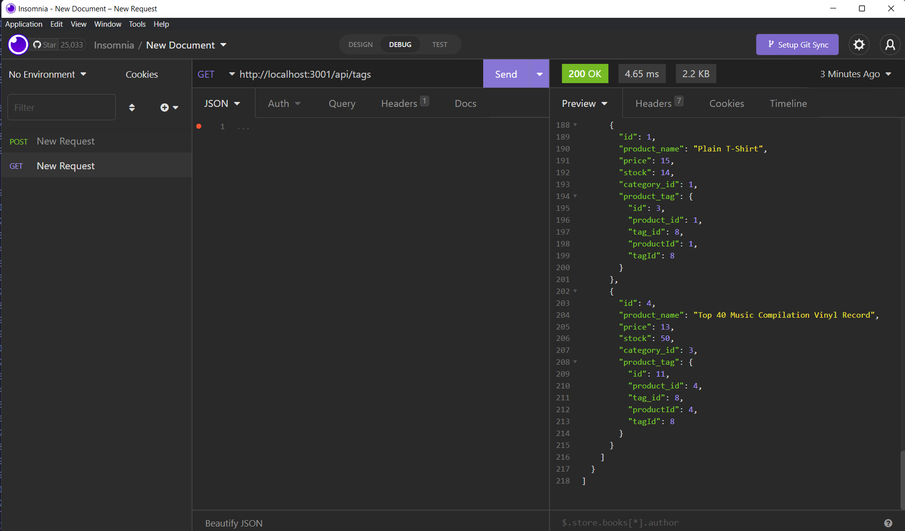

# E-Commerce Back End

## Description

This application will allow the users to manage their internet retail web page from the back end.
<br><br>

<br><br>
Click [HERE](https://drive.google.com/file/d/1GwqH_REfMnNpiSeRPdx9GewKBgRet2jB/view) to view a full video demonstrating a walkthrough of how to run the application.

    
## Table of Contents
    
- [Description](#description)
- [Installation](#installation)
- [User Story](#usage)
- [Acceptance Criteria](#acceptance-criteria)
- [License](#license)
- [Contribution](#contribution)
- [Tests](#tests)
- [Questions](#questions)
    
## Installation
    
```
mysql -u root -p

SOURCE schema.sql;
```

```
npm run seed
```

```
npm start
```


## User Story
    
```
AS A manager at an internet retail company
I WANT a back end for my e-commerce website that uses the latest technologies
SO THAT my company can compete with other e-commerce companies

```
## Acceptance Criteria
```
GIVEN a functional Express.js API
WHEN I add my database name, MySQL username, and MySQL password to an environment variable file
THEN I am able to connect to a database using Sequelize
WHEN I enter schema and seed commands
THEN a development database is created and is seeded with test data
WHEN I enter the command to invoke the application
THEN my server is started and the Sequelize models are synced to the MySQL database
WHEN I open API GET routes in Insomnia for categories, products, or tags
THEN the data for each of these routes is displayed in a formatted JSON
WHEN I test API POST, PUT, and DELETE routes in Insomnia
THEN I am able to successfully create, update, and delete data in my database


```
    
## License
    

    
## Contribution
    
N/A
    
## Tests
    
N/A
    
## Questions
    
If there are any questions or concerns, please contact me at:<br>
[GitHub](https://github.com/khanhpbui)<br>
[Email](mailto:pkkhanhbui@gmail.com)